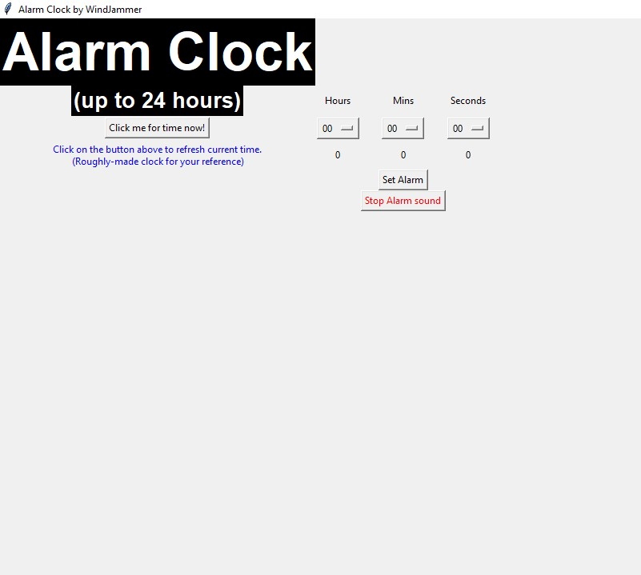
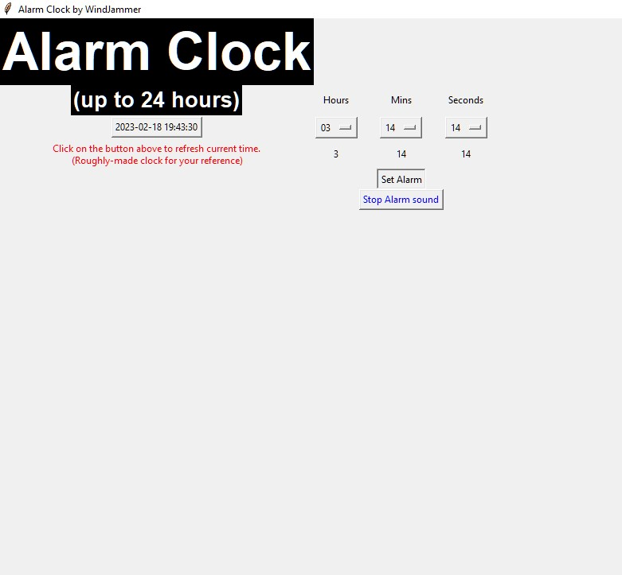
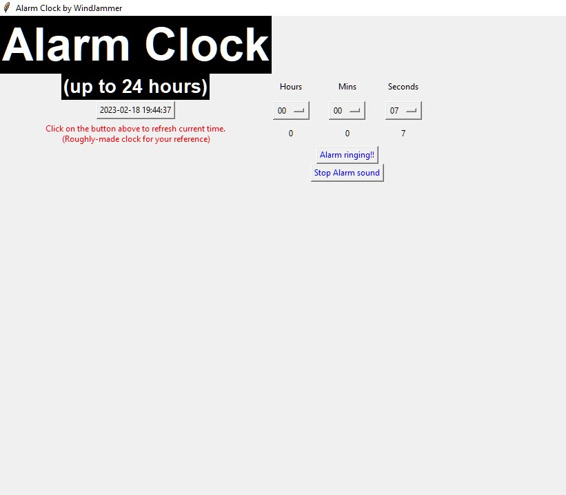

# Countdown-Alarm-Clock-with-GUI-Python :watch::computer:
A simple Countdown Alarm Clock in Python (up to 24hr, with GUI). Python libraries used: tkinter, datetime, time, winsound

## Thoughts on starting this project
My sixth programming project, in Python. 

Making the alarm clock with GUI was my initial idea as most of the Alarm Clock projects online are with GUI, but I made 1 without GUI
so that working up to this one would be more progressive and not a big stretch. 

However, a big difference is that this acts more like a countdown alarm clock, which the user inputs number of hours, mins, secs and the clock will just countdown until zero seconds, 
insted of counting up till the datetime the user has set which is how my fifth project's alarm clock (no GUI) works. I wanted to make it work in a similar way, but I decided to
move on when I thought it might too long for me to figure out if I attempt to do so.

Additionally I wanted to at least display the time (in 24 hrs) based on the user's hours, mins, secs input where the clock will set off, but I havent managed to do that as well :weary: so 
at least it might look more user-friendly. Maybe another time.

Even though Alarm Clock and Alarm Clock with GUI both aims to work the same, their code looks vastly different due to the need to incorporte widgets from the
tkinter library such as Label, Button, OptionMenu, Checkbox to make stuff appear in the app, and not as simple as typing print. Incorporating commands for widgets 
are also completely new and not the same as self-defining functions, and self-defining functions can also and will be what the widgets execute as commands.

Took me a while to get used to tkinter library due to the vastly different commands and formatting. (the considerations of foreground and background colouring, as well as
position and size of the widgets in the app on the screen).

<br>

Computer program used for coding: VS Code

## Code description
Let's start with:
1. Imported Libraries
2. Self-defined functions
3. Main code

<br>

<br>

**1. Imported Libraries**
```python
import tkinter
import datetime
import time
import winsound
```
Imported libraries, tkinter (basically a Graphic User Interface library for Python), datetime, time and winsound.

<br>

<br>

**2. Self-defined functions**
```python
def time_now():
    while True:
        datetime_today = datetime.datetime.today().replace(microsecond=0)
        clock_button.configure(text=datetime_today)
        break
```
Gets date and time of the present time (year, month, day, hours, minutes, second, microsecond). If keeps refreshing the variable will keep changing.

The 'time_now()' function is the command for the clock button when pressed in the main code. The text on the button will then display current time due to the 'clock_button.configure(text=datetime_today)',
and will change if pressed again in the future based on the time. Acts somewhat as a reference for user for current time.

<br>

```python
def set_alarm_command():
    bt.configure(text="Alarm is running... ")
    total_seconds_countdown = (default_input_hour_bt.get() * 60) + (default_input_min_bt.get() * 60) + default_input_sec_bt.get()
    
    while total_seconds_countdown > 0:
        print(total_seconds_countdown)
        total_seconds_countdown -= 1
        time.sleep(1)

        if total_seconds_countdown == 0:
            bt.configure(text="Alarm ringing!!", fg="red")
            winsound.PlaySound("defaultsound", winsound.SND_ASYNC + winsound.SND_LOOP)
            break
```
The 'set_alarm_command()' function is the command for the set alarm button when pressed in the main code. The text on the button will then display 'Alarm is running...' due
to the bt.configure(text="Alarm is running... ") to indicate the alarm clock is running.

Made text on the button red in colour because it seems appropriate. :laughing:

As this projects works more like a countdown alarm clock instead of counting until to a specific datetime, the total timer is taken by converting the hours, minutes and
seconds into seconds, and will then countdown with the while loop, by subtracting 1 every second (with time.sleep(1)). When timer hits zero, the app
will then play the default sound from winsound and break out of the loop.

<br>

```python
def stop_alarm_sound():
    winsound.PlaySound(None, 0)
```
The 'stop_alarm_sound()' function is the command for the stop alarm button when pressed in the main code. When pressed, the alarm sound, if running will stop.

<br>

```python
def show_hr(*args):
    str_out_hr.set(default_input_hour_bt.get())

def show_min(*args):
    str_out_min.set(default_input_min_bt.get())

def show_sec(*args):
    str_out_sec.set(default_input_sec_bt.get())
```
These functions are the commands for the label widgets when an option is selected from the OptionMenu, and tells those labels to be set (with .set()) as whatever option the user
has chosen from the 'default_input_hour_bt.get()', 'default_input_min_bt.get()' and 'default_input_sec_bt.get()'.

We need to pass the argument '*args' through the function as from what I've learnt online, this function is taking an unknown number of arguments from the user (user's
input) from OptionMenu.

<br>

<br>

**3. Main code**
```python
window = tkinter.Tk()
window.title("Alarm Clock by WindJammer")
```
Creates the window where the app will run and storing it in the variable 'window'.

Setting title to "Alarm Clock by WindJammer".

<br>

```python
tkinter.Label(window, text = "Alarm Clock", font=("Arial Bold", 50), fg = "white", bg = "black").grid(row=0, column=0)
```
The first widget (Label) in the window.(the big, 'Alarm Clock' title in the GUI)

Parameters in the Label Widget window, text, font size, foreground colour, background colour. Followed by its positioning, using grid() and specifying row and column
in relation to all other widgets in the app. If there are no other widgets in the app and you put e.g. row=4 and column=8, it will still go to top left.

Self-note: There are 3 ways to decide positioning widgets in a website with tkinter, pack(), grid(), place(). In a window, you can only choose to use 1 of these for
all your widgets.

<br>

```python
tkinter.Label(window, text = "(up to 24 hours)", font=("Arial Bold", 20), fg = "white", bg = "black").grid(row=1, column=0)
```
The second widget (Label) in the window. (the line below the big, 'Alarm Clock' title in the GUI)

It is 'grid(row=1, column=0)', hence it is positioned on the same column, but 1 row below the 'Alarm Clock' label widget.

<br>

```python
clock_button = tkinter.Button(window, text = "Click me for time now!", command = time_now)
clock_button.grid(row=2, column=0)
```
The third widget (Button) in the window. (button below the "(up to 24 hours)")

Has text "Click me for time now!" on the button. 

Runs the 'time_now' command when pressed. See 'time_now()' function in self-defined functions.

The 'grid() command' is placed in a new line as (for a reason that
I found online but has forgotten), the code does not run if that widget has a command to execute, it will not execute if there is a positioning functioning at the
end of that line. (grid(), pack(), place())

It is 'grid(row=2, column=0)', hence it is positioned on the same column, but 2 rows below the 'Alarm Clock' label widget.

<br>

```python
tkinter.Label(window, text = "Click on the button above to refresh current time.\n (Roughly-made clock for your reference)", fg = "blue").grid(row=3, column=0)
```
The fourth widget (Label) in the window. (below the clock button)

Just displays a line of text programmed into the code.

<br>

```python
#H, M, S Labels
hours_label = tkinter.Label(window, text = "Hours")
hours_label.grid(row=1, column=1)
mins_label = tkinter.Label(window, text = "Mins")
mins_label.grid(row=1, column=2)
secs_label = tkinter.Label(window, text = "Seconds")
secs_label.grid(row=1, column=3)
```
These Label widgets are placed on top of their respective OptionMenu boxes to indicate which OptionMenu represents. (hours, mins, seconds)

<br>

```python
#H, M, S Entries
#Hours OptionMenu
default_input_hour_bt = tkinter.IntVar(window)
options_hour_bt = ['00', '01', '02', '03', '04', '05', '06', '07',
		'08', '09', '10', '11', '12', '13', '14', '15',
		'16', '17', '18', '19', '20', '21', '22', '23']
default_input_hour_bt.set(options_hour_bt[0])
hour_bt = tkinter.OptionMenu(window, default_input_hour_bt, *options_hour_bt)
hour_bt.grid(row=2, column=1)
```
These are the OptionMenu widgets. Hours, minutes and seconds OptionMenu widgets work the same, so I will just analyse 1 of them, as functionality and structure for all
3 of them are the same.

Looking at the Hours OptionMenu and code under it:

'default_input_hour_bt = tkinter.IntVar(window)' sets a variable, 'default_input_hour_bt', which will contain an integer in the window.

'options_hour_bt = ['00', '01', ... '22', '23']' makes the list of options the user has to choose from in the OptionMenu widget.

'default_input_hour_bt.set(options_hour_bt[0])' sets default option as 0.

'hour_bt = tkinter.OptionMenu(window, default_input_hour_bt, *options_hour_bt)' creates the OptionMenu. Parameters are (window, the type variable of the options, the list
of options). Apparently, in '*options_hour_bt' the '*' is needed to take the items in the list as elements, seperated by the comma, else it will take the entire content
in the list as a single option/element.

'hour_bt.grid(row=2, column=1)' shows the widget's positioning.

<br>

```python
#Labelling option selected/output for hours
str_out_hr = tkinter.IntVar(window)

#hr_bt = tkinter.Button(window, text="Update", command=lambda: show_hr())
#hr_bt.grid(row=3, column=1)
output_hr = tkinter.Label(window, textvariable = str_out_hr)
output_hr.grid(row=3, column=1)
default_input_hour_bt.trace('w', show_hr)
```
These are Label widgets under the OptionMenus for hours, minutes and seconds, which will display whatever option the user has selected in the OptionMenu as a sort of
confirmation. All 3 works the same so I will similarly just analyse 1 of them, as functionality and structure for all 3 of them are the same.

Looking at the labelling option selected/output for hours and code under it:
'str_out_hr = tkinter.IntVar(window)' sets a variable, 'str_out_hr', which will contain an integer in the window.

'output_hr = tkinter.Label(window, textvariable = str_out_hr)' creates the Label widget. Parameters are (window, text/textvariable). The textvariable will be changing shown in
the lines of code immediately after hence a variable 'str_out_hr' is used.

'output_hr.grid(row=3, column=1)' shows the widget's positioning.

'default_input_hour_bt.trace('w', show_hr)' tells the Label widget that textvariable 'str_out_hr' will change and show that change immediately based on the different
options the user picks using the self-defined function 'show_hr'. Parameters are (self, mode, callback). The mode has 3 different ones, (r)read, (w)write, (u)undefined.

Runs the 'show_hr' function. See 'show_hr(*args)' in self-defined functions.

<br>

```python
#Set Alarm button
bt = tkinter.Button(window, text="Set Alarm", command = set_alarm_command)
bt.grid(row=4, column=2)
```
Has text "Set Alarm" on the button. 

The set alarm button widget. Runs 'set_alarm_command' when pressed. See 'set_alarm_command()' in self-defined functions.

'bt.grid(row=4, column=2)' shows the widget's positioning.

<br>

```python
#Stop Alarm button
bt_stop = tkinter.Button(window, text="Stop Alarm sound", fg = "red", command = stop_alarm_sound)
bt_stop.grid(row=5, column=2)
```
Has red text "Stop Alarm sound" on the button. 

The stop alarm button widget. Runs 'stop_alarm_sound' when pressed. See 'stop_alarm_sound()' in self-defined functions.

'bt.grid(row=4, column=2)' shows the widget's positioning.

<br>

```python
window.mainloop()
```
This code will run the lines of code up to it for the website. Any code below it will not run unless there is another '.mainloop()' further down the code.

<br>

<br>

## Output


Default page


```
7
6
5
4
3
2
1
```

When clock button is clicked, options selected in OptionMenus and set alarm button is pushed. Output in the terminal showing countdown as well.



When alarm time is up and timer hits zero. Default sound will be playing when the "Alarm ringing!!" text shows up

<br>

<br>

## Thoughts after the project
This is my first time creating an app that can be used to engage with users via an app. I have previously taken a look at other GUI Python libraries such as
Flutter and Dart (more for mobile apps and require an Android emulator to work) and noticed the way they work does have their similarities. (e.g. using of 
Widgets, though they offer different types of Widgets)

<br>

To be improved:
* Flaw is that when set button is pushed, nothing happens, until the timer is up and the alarm sound starts playing. I believe it will be much more user-friendly if
I am able to add a visual countdown timer on the app instead of just in the terminal which the ueser of the app will not be able to see, Showing the datetime when
the timer will go off will make the app more user-friendly as well.
* Swapping the clock button with a real-time counting up clock would be better, instead of clicking it whenever they need a time reference. Still hasnt figure that out... 
but should be definitely possible
* Positioning of widgets are awkward as well, definitely ways to improve on the positioning.

<br>

Have a gif:


